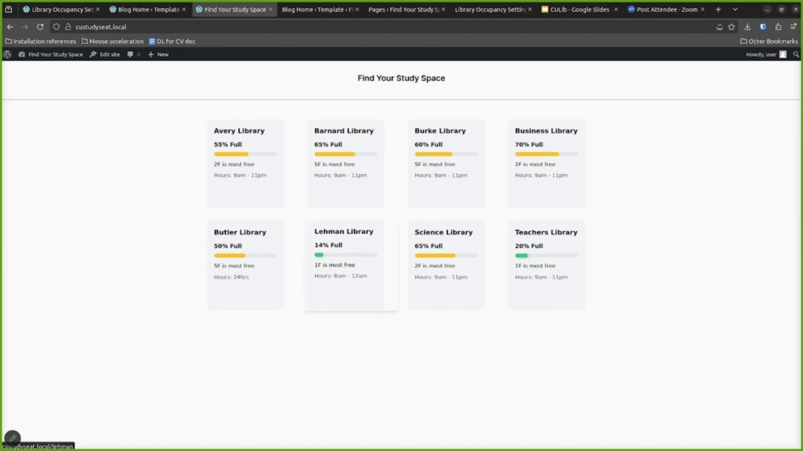

# CU@Lib: Columbia University Library Occupancy Plugin

A WordPress plugin that displays real-time library occupancy data for Columbia University libraries, providing students and staff with up-to-date information about library capacity.

## 📋 Table of Contents

- [Project Objectives](#project-objectives)
- [Demo](#demo)
- [Features](#features)
- [Getting Started](#getting-started)
- [Installation](#installation)
- [Login Credentials](#login-credentials)
- [File Structure](#file-structure)
- [Resources](#resources)

## 🎯 Project Objectives

Columbia University Libraries uses WiFi connection data to estimate library occupancy levels. However, the main website displaying this information is frequently under maintenance, leaving students without access to crucial capacity information.

**Our Solution:** A WordPress plugin that bridges the gap between technical flexibility and ease of use.

### Key Objectives:

- **Reliability**: Provide continuous access to library occupancy data even when the main website is under repair
- **Accessibility**: Enable non-technical library staff to manage content and notices without engineering support
- **Real-time Updates**: Display library capacity information with higher frequency and accuracy
- **User Empowerment**: Give librarians direct control over their web presence while maintaining technical sophistication
- **Seamless Integration**: Work within WordPress ecosystem for easy deployment and maintenance

This plugin balances technical capabilities with user-friendly management, ensuring students always have access to library occupancy information when they need it most.

## 🎬 Demo

### Screenshots




### Video Demo

Watch the full demonstration: [https://youtu.be/4l-oOLacSHw](https://youtu.be/4l-oOLacSHw)

## ✨ Features

- Real-time library occupancy tracking
- Visual occupancy indicators
- Admin dashboard for managing settings
- Customizable display options
- WordPress block integration
- Mock Flask server for testing

## 🚀 Getting Started

### Prerequisites

- [Local WP](https://localwp.com/) - WordPress development environment
- Python 3.x
- pip (Python package manager)

## 📦 Installation

**Note:** You only need to use `app.py`, `CUStudySeat.zip`, and `library-occupancy.zip`. The `assets` folder contains working code files for reference.

### Step 1: Set Up Python Environment

1. Install required Python packages:
   ```bash
   pip install flask-cors flask
   ```

2. **(Mac & Linux only)** Create and activate virtual environment:
   ```bash
   python -m venv venv
   source venv/bin/activate
   ```

3. **(Windows)** Create and activate virtual environment:
   ```powershell
   python -m venv venv
   .\venv\Scripts\Activate.ps1
   ```

### Step 2: Start Flask Server

1. Navigate to the folder containing `app.py`
2. Run the mock Flask server:
   ```bash
   python app.py
   # or
   python3 app.py
   ```

### Step 3: Set Up WordPress

1. Download and install [Local WP](https://localwp.com/)
2. Import `CUStudySeat.zip` into Local WP (this imports the WordPress website)
3. Start the imported website in Local WP
4. Install the `library-occupancy.zip` plugin through the WordPress admin panel or by extracting it to the plugins directory

### Step 4: Activate and Configure

1. Log in to WordPress admin (see credentials below)
2. Navigate to Plugins and activate "Library Occupancy"
3. Configure settings through the admin dashboard
4. Add the Library Occupancy block to your desired pages

## 🔐 Login Credentials

**Username:** `user`  
**Password:** `Temp1232`

> ⚠️ **Security Note:** Change these credentials in a production environment!

## 📁 File Structure

```
CU-at-Lib/
├── app.py                          # Flask mock server for testing
├── README.md                       # Project documentation
├── CUStudySeat.zip                 # Complete WordPress site (import to Local WP)
├── library-occupancy.zip           # Plugin package (import to WordPress)
├── assets/                         # Source code files
│   └── library-occupancy/
│       ├── block.json              # Block configuration
│       ├── library-occupancy.php   # Main plugin file
│       ├── admin/                  # Admin interface
│       │   ├── admin.php
│       │   ├── css/
│       │   │   └── admin-style.css
│       │   └── views/
│       │       ├── dashboard.php
│       │       └── settings.php
│       ├── includes/               # Core functions
│       │   └── functions.php
│       └── public/                 # Frontend assets
│           ├── css/
│           │   └── block-style.css
│           └── js/
│               ├── block.js
│               ├── detailed-block.js
│               └── frontend.js
└── images/                         # Demo screenshots and assets
```

### Key Components

| File/Folder | Description |
|-------------|-------------|
| `CUStudySeat.zip` | Complete WordPress site package for import into Local WP |
| `library-occupancy.zip` | Current working version of the plugin for WordPress installation |
| `app.py` | Flask server providing mock library occupancy data |
| `assets/` | Source code for the library-occupancy plugin |
| `images/` | Demo GIFs and screenshots |

## 📚 Resources

This project was built using the following resources:

- [WordPress.tv](https://wordpress.tv/) - Official WordPress tutorials
- [WordPress Plugin Development Tutorial](https://www.youtube.com/watch?v=tYLfC8nNPLs)
- [WordPress Block Development](https://www.youtube.com/watch?v=JZslURB8tos)

## 🤝 Contributing

Contributions are welcome! Please feel free to submit a Pull Request.

## 📄 License

This project is part of Columbia University's initiative to improve library services.

## 💬 Support

For questions or issues, please open an issue in this repository.

---

**Made with ❤️ for Columbia University Libraries**
